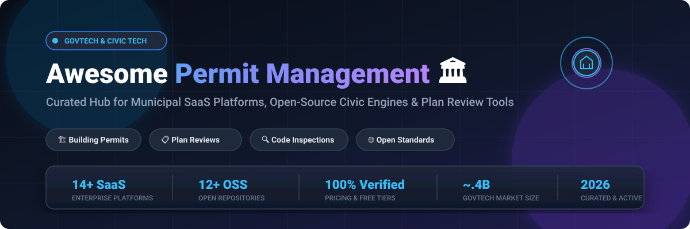



  

  
  
  
  
  
  
  

---

# 🏛️ Awesome Permit Management & Civic Tech Ecosystem

> ⚡ **A curated directory of leading SaaS platforms, enterprise civic systems, and open-source software for Municipal Permitting, Electronic Plan Review (e-Review), Code Enforcement, Licensing, and Workflow Automation.**

**Last updated:** September 2026 | **Curated for:** Municipal CIOs, GovTech Architects, Urban Planners & Civic Engineers 🚀

---

## 📑 Table of Contents

- [🌟 Overview & SEO Taxonomy](#-overview--seo-taxonomy)
- [🏢 SaaS / Hosted Municipal Platforms](#-saas--hosted-municipal-platforms)
  - [📊 Market Size & Industry Structure](#-market-size--industry-structure)
  - [📋 SaaS Comparison Table](#-saas-comparison-table)
- [🔓 Open-Source GitHub Projects](#-open-source-github-projects)
  - [🏆 Top Repositories (Ranked by Stars)](#-top-repositories-ranked-by-stars)
  - [🧱 Open Architectural Building Blocks](#-open-architectural-building-blocks)
- [📈 Star History](#-star-history)
- [🤝 How to Contribute](#-how-to-contribute)
- [📜 License & Disclaimer](#-license--disclaimer)

---

## 🌟 Overview & SEO Taxonomy

Modern local governments, building departments, regional authorities, and state agencies rely on digital **Permit Management Systems (PMS)** and **Land Management Systems (LMS)** to eliminate paper bottlenecks, coordinate multi-agency reviews, enforce compliance, and deliver intuitive digital portals for citizens and contractors.

### 🔍 Key Capabilities & Focus Areas
- 🏗️ **Building & Trade Permitting:** Residential, commercial, electrical, plumbing, mechanical, and solar permitting pipelines.
- 📐 **Electronic Plan Review (e-Review):** Collaborative PDF/BIM markup, version stamping, and spatial routing.
- 🔍 **Field Inspection Management:** Mobile inspector apps, geolocation check-ins, automated deficiency notices, and real-time scheduling.
- ⚖️ **Code Enforcement & Case Management:** Complaint intake, parcel tracking, automated violation notices, and court citation workflows.
- 📜 **Business & Occupational Licensing:** Short-term rentals, contractor licensing, renewals, fee calculations, and payment gateways.
- 🌐 **Open Standards & Interoperability:** Standardized GIS integration (ESRI ArcGIS, PostGIS), BLDS data feeds, and OpenPermit API protocols.

---

## 🏢 SaaS / Hosted Municipal Platforms

### 📊 Market Size & Industry Structure

> 💡 **Market Overview & Industry Dynamics:**  
> The global government permitting, licensing, and land management software market is estimated at **~.4 Billion in 2026** and projected to expand to **~.1 Billion by 2031** at a **Compound Annual Growth Rate (CAGR) of 9.8%**.  
> **Market Fragmentation:** The sector exhibits a **moderately fragmented structure undergoing rapid consolidation**. While large enterprise conglomerates (e.g., Tyler Technologies, Cox Enterprises/OpenGov, Constellation Software/CityView, CentralSquare) control a significant share of tier-1 and tier-2 city contracts, agile cloud-native providers (e.g., Cloudpermit, PermitFlow) and specialized niche platforms continue to capture significant market share across tier-3/4 municipalities, regional counties, and private developer ecosystems.

---

### 📋 SaaS Comparison Table

*The table below is sorted descending by company scale, valuation, and enterprise revenue footprint.*

| 🏢 Platform | 🎯 Description & Focus | 📈 Company Scale / Valuation | 💰 Pricing (Starting Tier) | 🎁 Free Tier / Trial Limits |
| :--- | :--- | :--- | :--- | :--- |
| **[Permit Vision (Wolters Kluwer)](https://www.wolterskluwer.com/en/solutions/enablon)** | Industrial electronic permit-to-work (PTW), operational risk, and environmental compliance platform. | **~+ Market Cap** (~.0B Revenue, Euronext: WKL) | Starts at ~/user/month (~,000/month enterprise deployment starter) | No free forever plan; enterprise evaluation access during technical RFP / POC phase (0-day public trial) |
| **[Tyler Technologies EnerGov](https://www.tylertech.com/)** | Full-scale civic permitting, land management, and licensing software for mid-to-large cities and counties. | **~+ Market Cap** (~.1B Revenue, NYSE: TYL) | Starts at ~,000/year (entry-level municipal deployment tier) | No free forever plan; guided sandbox evaluation access during formal procurement review (0-day public trial) |
| **[OpenGov Permitting & Licensing](https://opengov.com/)** | Cloud-native public sector suite for permitting, licensing, e-review, and multi-department workflow routing. | **~.8B Valuation** (Acquired by Cox Enterprises; ~+ ARR) | Starts at ~,000/year (base tier for small municipal jurisdictions, unlimited users) | No free forever plan; 30-day agency sandbox pilot upon qualified demonstration |
| **[CentralSquare Community Development](https://www.centralsquare.com/)** | Public sector administration, land management, and automated planning suite for local governments. | **~.5B Valuation** (~+ Revenue; Bain Capital & Vista Equity) | Starts at ~,000/year (entry-level municipal licensing tier) | No free forever plan; vendor-assisted POC pilot during procurement review (0-day public trial) |
| **[Accela Civic Platform](https://www.accela.com/)** | Enterprise civic application suite covering permitting, inspections, planning, and environmental health. | **~.0B+ Valuation** (~+ ARR; Berkshire Partners) | Starts at ~,000/year (~,200/user/year or base package on municipal GSA schedule) | No free forever plan; 30-day proof-of-concept pilot environment for government agencies upon request |
| **[CivicPlus Community Development](https://www.civicplus.com/)** | Integrated civic permitting, licensing, code enforcement, and digital plan review platform. | **~ Valuation** (~+ Revenue; Insight Partners) | Starts at ~,500/year (base community module tier; citizen/contractor portal access is free) | No free forever plan; 14-day sandbox demonstration access for municipal administrators |
| **[CityView (Harris Computer)](https://www.cityview.com/)** | Municipal suite supporting permitting, digital plan review, inspections, and code enforcement. | **~.5B Harris Division Rev** (Parent Constellation CSU ~ Cap) | Starts at ~,000/year (small-town baseline package) | No free forever plan; vendor-led demo sandbox with preloaded test data (0-day public trial) |
| **[SmartGov (Granicus)](https://granicus.com/solution/smartgov/)** | Cloud permitting, licensing, and code enforcement portal for local government operations. | **~+ Granicus ARR** (Vista Equity & Harvest Partners) | Starts at ~,000/year (entry tier for small municipalities) | No free forever plan; 30-day guided pilot instance for qualified local government agencies |
| **[PermitFlow](https://www.permitflow.com/)** | Construction permitting workflow platform for general contractors, developers, and architects. | **~ -  Valuation** (+ Raised; Kleiner Perkins & Felicis) | Starts at ~/month (,000/year for starter contractor project volume) | No free forever plan; 14-day single-project onboarding pilot for licensed contractors |
| **[Cloudpermit](https://cloudpermit.com/)** | Digital community development & permitting platform with online intake and mobile field inspections. | **~ -  Valuation** (~+ ARR; Bregal Milestone & Vaaka) | Starts at ~,500/year (entry municipal tier with unlimited user licensing) | No free forever plan; 14-day interactive test workspace for municipal departments upon request |
| **[GovPilot](https://www.govpilot.com/)** | Cloud-based municipal management operating system with 125+ purpose-built government modules. | **~ -  Valuation** (~+ ARR) | Starts at ~,600/year (/month entry tier for micro/small municipalities) | No free forever plan; 14-day interactive sandbox account for municipal staff |
| **[Clariti](https://www.clariti.com/)** | Salesforce-native enterprise permitting, licensing, and compliance management platform. | **~ -  Valuation** (~+ ARR) | Starts at ~,800/year (single-seat baseline) to ~,000/year (agency starter package) | No free forever plan; 14-day guided test sandbox upon sales evaluation |
| **[iWorQ Systems](https://iworq.com/)** | Community development and permitting software tailored for small to mid-sized local governments. | **~ -  Valuation** (~+ ARR, 1,800+ municipal clients) | Starts at ~,500/year (base population tier under 5,000 residents, unlimited users) | No free forever plan; 30-day fully functional trial account with sample agency data |
| **[MyGov](https://mygov.us/)** | Modular community development suite offering building permits, planning, and inspections. | **~ -  Valuation** (~ -  ARR) | Starts at ~/month (,260/year billed annually per core module) | No free forever plan; 14-day limited feature demo sandbox for city staff |

---

## 🔓 Open-Source GitHub Projects

Open-source civic tech tools provide critical building blocks for data interoperability, spatial analysis, custom BPMN workflow engines, and federal review portals.

### 🏆 Top Repositories (Ranked by Stars)

*Repositories are sorted descending by GitHub stargazers count with real-time social badges linking to their respective stargazers pages.*

| 📦 Repository / Project | ⭐ GitHub Stars | 🏷️ Primary Category | 📝 Description & Architectural Role |
| :--- | :---: | :--- | :--- |
| **[QGIS](https://github.com/qgis/QGIS)** |  | Spatial GIS Engine | Industry-standard open desktop and server GIS used by municipalities worldwide for parcel zoning, environmental overlays, and spatial permit boundary validation. |
| **[Camunda BPMN Platform](https://github.com/camunda/camunda-bpm-platform)** |  | Workflow Automation | Robust BPMN 2.0 process engine and DMN decision table engine used to orchestrate complex municipal permit review pipelines, agency routing, and SLA notifications. |
| **[PostGIS](https://github.com/postgis/postgis)** |  | Spatial Database | Spatial database extender for PostgreSQL that enables location queries, jurisdiction zoning checks, and parcel boundary geometry validation in permit databases. |
| **[Form.io Core](https://github.com/formio/formio)** |  | Dynamic Intake Forms | Combined form builder and JSON runtime engine for building dynamic citizen permit application forms, conditional submittal requirements, and inspection checklists. |
| **[CKAN](https://github.com/ckan/ckan)** |  | Open Data Portal | Open-source data management system powering public municipal open data portals, permit transparency portals, and historical building permit datasets. |
| **[SpiffWorkflow](https://github.com/sartography/SpiffWorkflow)** |  | Python Workflow Engine | Python-based BPMN execution engine designed for executing visual process models, conditional business logic, and automated municipal permit state transitions. |
| **[GeoMoose](https://github.com/geomoose/geomoose)** |  | Web Web GIS Framework | Lightweight, modular web mapping client widely adopted by local and county governments to expose property records, zoning maps, and permit locations to the public. |
| **[permit-portal](https://github.com/acgsa/permit-portal)** |  | Federal Review Portal | Open-source centralized federal permit portal focused on streamlining NEPA (National Environmental Policy Act) reviews, multi-agency consultations, and inter-departmental milestone tracking. |
| **[OpenPermit Specification](https://github.com/openpermit/openpermit.github.io)** |  | Interoperability Standard | Standardized RESTful API specification and schema for querying permit requirements, real-time application status, and inspection records across disparate municipal jurisdictions. |
| **[CodeNForce](https://github.com/TechnologyRediscovery/codenforce)** |  | Code Enforcement App | Open-source web application designed for municipal code enforcement officers to manage violation notices, inspection tracking, and occupancy permit administration. |
| **[e-permit Schemas](https://github.com/e-permit/epermit-schema)** |  | Schema & Verification | Standardized electronic permit data models, JSON schemas, and cryptographic verification tooling for verifiable digital municipal credentials. |
| **[XPlanung-light](https://github.com/mrmap-community/xplanung_light)** |  | Spatial Planning Tools | Open-source utilities for publishing and converting spatial planning and zoning datasets in compliance with European spatial data infrastructures (INSPIRE). |

---

### 🧱 Open Architectural Building Blocks

When building custom or hybrid municipal permit infrastructure, modern GovTech engineering teams typically compose these open-source tiers:

`
┌─────────────────────────────────────────────────────────────┐
│               🌐 Citizen & Contractor Portal                │
│    (Dynamic Forms with Form.io + OpenPermit REST/GraphQL)   │
├─────────────────────────────────────────────────────────────┤
│               ⚙️ Workflow & Review Routing                  │
│    (BPMN Engines: Camunda / SpiffWorkflow State Machine)    │
├─────────────────────────────────────────────────────────────┤
│               🗺️ Spatial & Zoning Overlays                  │
│    (PostGIS + GeoMoose / QGIS Web Map Services)             │
├─────────────────────────────────────────────────────────────┤
│               📊 Open Data & Transparency Feed              │
│    (CKAN Public Catalog + BLDS Data Standards)              │
└─────────────────────────────────────────────────────────────┘
`

---

## 📈 Star History

---

## 🤝 How to Contribute

We welcome contributions from municipal IT specialists, GovTech developers, and civic tech enthusiasts! 🌟

1. 🍴 **Fork the repository.**
2. 🌿 **Create a descriptive branch:** git checkout -b feature/add-new-platform
3. 📝 **Add or update entries in README.md** adhering to the tabular structure:
   - Include platform name, hyperlink, concise description.
   - Provide verified company scale / revenue / valuation figures.
   - Specify accurate entry starting tier pricing and concrete free tier/trial limits.
4. ✅ **Ensure formatting matches the existing markdown standard.**
5. 🚀 **Submit a Pull Request with a clear summary of changes.**

---

## 📜 License & Disclaimer

- ⚖️ **License:** [Creative Commons Zero v1.0 Universal (CC0 1.0)](LICENSE) - Public Domain Dedication.
- ⚠️ **Disclaimer:** This repository is an independently curated community resource and does not constitute an endorsement. Municipal procurement involves rigorous legal, compliance, CJIS/SOC2 security, and public records requirements. Always verify pricing, SLA, and terms directly with software vendors.

---

  <b>Built with ❤️ for municipal IT teams, building officials, civic technologists, and government innovators.</b>

